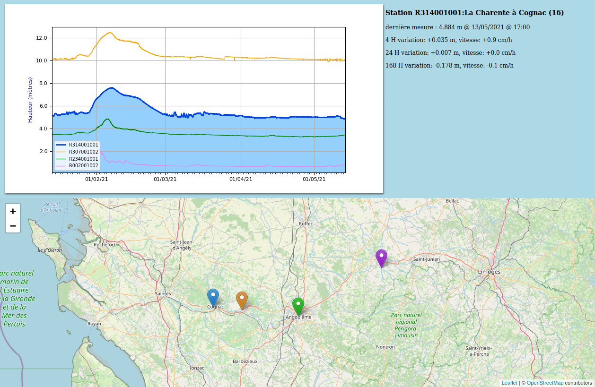

# hubeau.py
----
Language : Python 3.7+ ou 2.7
Suivi des hauteurs d'eau d'une reivière grace aux données libres du service public hubeau.
Génère un résultat en HTML5, CSS et Javascript dans un dossier "html" avec une image graphique du suivi de la hauteur d'un ou plusieurs points de mesure sur une rivière avec une carte et les dernières mesures de relevés.
Utilise les librairies Leaflet (javascript) pour créer une carte html via les données OpenStreetMap (OSM)

## Introduction
Script Python permettant d'interroger l'API publique française "hubeau" (hydrométrie). 
Permet de suivre les mesures de hauteur des cours d'eau Français diffusée par cette API.
Données diffusées en quasi temps réel.

- Télécharge les dernières mesures d'un ou plusieurs points de mesures (API HubEau via le format json)
- Stocke les mesures en local (base de données sqlite + sqlalchemy)
- Permet de mettre en graphiques l'historique des hauteurs d'eau (via matplotlib)
- Génère une page HTML5+CSS+Javascript de suivi des stations de mesures (via ElementTree)
- Intègre une carte des stations sur la page HTML via Leaflet et OpenStreetMap

Licence : BSD-3-Clause (ou BSD 2.0), voir https://en.wikipedia.org/wiki/BSD_licenses  
Copyright (c) 2010-2024, Pierre-Alain Dorange  
All rights reserved.

	Redistribution and use in source and binary forms, with or without
	modification, are permitted provided that the following conditions are met:
		* Redistributions of source code must retain the above copyright
		  notice, this list of conditions and the following disclaimer.
		* Redistributions in binary form must reproduce the above copyright
		  notice, this list of conditions and the following disclaimer in the
		  documentation and/or other materials provided with the distribution.
		* Neither the name of the <organization> nor the
		  names of its contributors may be used to endorse or promote products
		  derived from this software without specific prior written permission.

	THIS SOFTWARE IS PROVIDED BY THE COPYRIGHT HOLDERS AND CONTRIBUTORS "AS IS" AND
	ANY EXPRESS OR IMPLIED WARRANTIES, INCLUDING, BUT NOT LIMITED TO, THE IMPLIED
	WARRANTIES OF MERCHANTABILITY AND FITNESS FOR A PARTICULAR PURPOSE ARE
	DISCLAIMED. IN NO EVENT SHALL <COPYRIGHT HOLDER> BE LIABLE FOR ANY
	DIRECT, INDIRECT, INCIDENTAL, SPECIAL, EXEMPLARY, OR CONSEQUENTIAL DAMAGES
	(INCLUDING, BUT NOT LIMITED TO, PROCUREMENT OF SUBSTITUTE GOODS OR SERVICES;
	LOSS OF USE, DATA, OR PROFITS; OR BUSINESS INTERRUPTION) HOWEVER CAUSED AND
	ON ANY THEORY OF LIABILITY, WHETHER IN CONTRACT, STRICT LIABILITY, OR TORT
	(INCLUDING NEGLIGENCE OR OTHERWISE) ARISING IN ANY WAY OUT OF THE USE OF THIS
	SOFTWARE, EVEN IF ADVISED OF THE POSSIBILITY OF SUCH DAMAGE.

### Modules spécifiques utilisés
Ces modules Python sont à installer pour faire fonctionner le script hubeau.py.

#### requests 2.x 
Permet une interface simple pour interagir avec le protocole HTTP ("HTTP for humans").
* Lien : [request](https://requests.readthedocs.io/en/master/)
* Licence : [Apache2](https://requests.readthedocs.io/en/master/user/intro/#apache2-license)
* Installation (Debian) : apt install python3-requests
* Copyright 2019 Kenneth Reitz

#### MatPlotLib 2.3.x 
Permet de créer des graphiques à partir de données (ici mesures de hauteur d'eau).
* Lien : [matplotlib](https://matplotlib.org/)
* Licence : [PSF, compatible BSD](https://matplotlib.org/users/license.html])  
* Installation (Debian) : apt install python3-matplotlib
* Copyright 2019 Matplotlib Development Team
	
#### SQLAlchemy 1.4.x 
Permet de mettre en relation direct des objets python et une structure SQL.
Lien : [sqlalchemy](https://www.sqlalchemy.org/) / Licence : [MIT](https://www.sqlalchemy.org/download.html#license)  
* Installation (Debian) : apt install python3-sqlalchemy
Copyright 2005-2021 SQLAlchemy authors and contributors

### Outils additionnels (utilisés par la page HTML, sans installation)
Ces outils sont utilisés par la page HTML généré via internet, rien à installer.

#### OpenStreetMap ou OSM
Carte libre mondiale, utilisation du rendu de base OSM, via la librairie leaflet
* Lien : [OpenStreetMap](https://www.openstreetmap.org/) 
* Licence : [ODbL](https://opendatacommons.org/licenses/odbl/summary/)  
* Copyright OpenStreepMap contributors

#### Leaflet 1.7.x
Librairie Javascript permet de générer des cartes dynamique dans des pages HTML
* Lien : [Leaflet](https://leafletjs.com/)
* Licence : [BSD-2-Clause](https://github.com/Leaflet/Leaflet/blob/master/LICENSE)  
* Copyright 2010-2019, Vladimir Agafonkin / 2010-2011, CloudMade

#### leaflet-color-markers
Icônes de marqueurs de couleurs pour cartes leaflet  
* Lien : [leaflet-color-markers](https://github.com/pointhi/leaflet-color-markers)
* Licence : [BSD-2-Clause](https://github.com/pointhi/leaflet-color-markers/blob/master/LICENSE)  
* Copyright 2013-2020, Thomas Pointhuber

## Utilisation

Aucune interface GUI, utilisable uniquement depuis la ligne de commande (CLI).
Ce logiciel est destiné a être utilisé sous forme de tache de fond système (ex. Cron) ou lancer manuellement dans la ligne de commande. Dans cet usage de base le logiciel utilise les données du fichier de configuration *hubeau.ini* pour mettre à jour les données des stations configurées et afficher un fichier HTML présentant l'historique des mesures.

L'interface CLI permet aussi de faire des recherches de stations dans l'API HubEau ou d'afficher les données de stations spécifiques. C'est le moyen de trouver les stations qui pourrait vous intéresser localement puis de les configurer dans le fichier *hubeau.ini*

Les stations de mesures du réseau HubEau sont identifiés par un code unique normalisé : 1 lettre suivi de 9 chiffres
Les stations ont des données mises à jour entre 5 et 30 minutes suivant les stations.

Le script fonctionne ainsi sous 3 modes :

#### mode automatique
Sans aucun argument le script utilise alors le fichier de configuration (*hubeau.ini*) et réalise les opérations de mise à jour et d'affichage des courbes de suivi des cours d'eau qui y sont paramétrées.

Exemples :

- mettre à jour et afficher les données des stations paramétrées 

>	python hubeau.py

- afficher (sans mettre à jour) les données des stations hubeau.ini pour les 1000 derniers jours

>	python3 hubeau.py -d -t1000

#### mode semi-automatique
Avec l'argument -s on précise la ou les stations a interroger et à afficher (liste avec la virgule comme séparateur). Le fichier de configuration *hubeau.ini* n'est alors pas utilisé.

Exemples :

- voir les mesures de la Seine à Paris-Austerlitz des dernières 24 heures

> 	python3 hubeau.py -sF700000103 -t1	

- voir mesures de la Garonne à Toulouse (Pont Neuf) des derniers 10 jours

> python3 hubeau.py -sO200004001 -t10	

- voir et comparer la situation de la Garonne à Bordeaux et Toulouse sur la dernière semaine 

> python3 hubeau.py -sO972001001,O200004001 -t7

#### mode recherche station
Avec les arguments -r -n -c et -d on précise les critères de recherche de stations.
Ce qui permet de trouver les stations locales pour paramétrer éventuellement le fichier *hubeau.ini*.

Exemples :

- rechercher les stations du fleuve Garonne

> python3 hubeau.py -rGaronne

- rechercher les stations du département de la Charente (16)

> python3 hubeau.py -e16

- rechercher les stations de la ville de Bordeaux (code INSEE 33063)

> python3 hubeau.py -c33063

- rechercher les stations du fleuve Loire dans le département 37 :

> python3 hubeau.py -rLoire -e37

### Paramètres de ligne de commande :
	-h affiche l'aide
	-r permet une recherche des stations sur un cours d'eau par son nom (ex. Seine, Loire...)
	-n permet une recherche à partir du nom des stations (contient généralement le nom du cours d'eau et de la commune)
	-c permet une recherche selon le code INSEE d'une commune
	-e permet une recherche selon le code d'un département
	-s permet d'indiquer une ou plusieurs station(s) de mesure
		voir la classe Station (plus bas) pour plus de détails sur les stations et leurs identifiants
	-t permet de préciser la quantité de données a afficher dans la graphiques (en jours)
		chaque station propose environ les 30 derniers jours de mesure
		chaque station a sa propre fréquence de mesure (variable de 5 à 60 minutes)
	-g permet d'afficher le graphique de chaque station interrogée (actif par défaut)
	-m permet de réunir les données de toutes les stations dans un seul graphique (actif par défaut)
	-d permet d'afficher les données mais sans télécharger les dernières mesures
	-i permet d'afficher les informations des stations interrogées

### fichier de configuration (*hubeau.ini*)

Sans paramètres CLI, le script va utiliser le mode automatique, soit la configuration dans le fichier *hubeau.ini*

Le fichier *hubeau.ini* par défaut (livré) est configuré pour surveiller 4 stations sur le fleuve Charente (16) et met en valeur la station de mesure de la ville de Cognac. C'est un choix qui correspond à mon propre usage (j'habite dans ce coin).

Voir le fichier ini avec ses commentaires et le source de la classe Config pour les détails.

### Trouver les identifiants de stations

Pour trouver les numéros des stations qui vous intéresse, vous pouvez utiliser l'interface CLI du script (voir plus haut 'interface CLI') ou utiliser le site internet : https://www.vigicrues.gouv.fr/

Site internet Vigicrues :

Lorsque vous êtes sur la page d'une station, l'onglet "Info" vous permet de visualiser son identifiant. Les identifiants de station sont des codes uniques commençant par une lettre suivi de 9 chiffres. Les identifiants de station font partie du dictionnaire national SANDRE. Chaque station a une fréquence de mesures qui peut varier de 5 à 30 minutes.

ex : la station de Cognac (16) est identifier par : R314001001

## API et Données

HubEau est un service (API) de diffusion de données publiques de Eau France.
basé sur le dictionnaire de référence SANDRE
EauFrance est un service public d'information sur l'eau.

En savoir plus : 

- [HubEau](https://hubeau.eaufrance.fr)
- [EauFrance](https://www.eaufrance.fr/)
- [Généralités API](https://hubeau.eaufrance.fr/page/apis)
- [Sandre (référentiel)](http://www.sandre.eaufrance.fr/)

### API Hydrométrie

Cette API est mise à jour à partir des données PHyC toutes les 2 minutes sur les dernières 24 heures. Comprend un historique de données de 1 mois pour chaque station. Le présent script HubEau peut conserver un historique plus long avec sa base de données locale. Si on fait au moins 1 téléchargement par mois.

- [API Hydrométrie](https://hubeau.eaufrance.fr/page/api-hydrometrie)
- [Référenciel Hydrométrie](http://www.sandre.eaufrance.fr/notice-doc/r%C3%A9f%C3%A9rentiel-hydrom%C3%A9trique-3)

hubeau.py support l'API 1.1

### Données disponibles :
L'API HubEau dispose de 3 objets principaux :

- Sites : tronçon d'un cours d'eau ou les observations sont homogènes et comparables (non utilisé par le script).
- Stations : station d'observation d'un cours d'eau (appartient à un site)
- Observations : les observations d'une station

Les données sont disponibles dans plusieurs formats : CSV, JSON (utilisé ici), etc...
Les données retournées sont paginées, chaque page retourne un bloc de données avec un champ pour indiquer si il y a une suite. Taille maximale d'une page : 5000

Code retour de requête :

- 200 : OK toutes les réponses sont présentes
- 206 : OK il reste des données disponibles (pages suivantes)
- 400 : requête incorrecte
- 401 : accès non autorisé
- 403 : accès interdit
- 404 : non trouvé
- 500 : erreur interne du serveur

#### Stations

Les stations appartiennent a un site et sont identifiés par un identifiant unique et contiennent des informations géographique.

- code_station : code station unique selon référentiel SANDRE
- libelle_station : nom de la station en clair, contient généralement le nom du cours d'eau et de la commune
- code_site : code du site
- libelle_site : nom du site en clair
- code_commune_station : code de la commune ou se trouve la station (INSEE)
- libelle_commune : nom de la commune ou se trouve la station
- code_departement : code du département ou se trouve la station (INSEE)
- code_region : code de la région ou se trouve la station (INSEE)
- code_cours_eau : code du cours d'eau sur lequele se trouve la station (SANDRE) 
- type_station
- coordonnee_x_station
- coordonnee_y_station
- code_projection
- longitude : position géographique de la station
- latitude : position géographique de la station
- influence_locale_station
- commentaire_station
	
#### Mesures

Les dates sont exprimées UTC au format **[ISO 8601](https://fr.wikipedia.org/wiki/ISO_8601)**

Les hauteurs d'eau (H) sont exprimées en **millimètres** (mm), convertie en **mètres** (m) pour le stockage dans la base de données locale. 

Les débits (Q) sont exprimés en **litre par seconde** (l/s) et pas toujours disponibles: non utilisé par le script.

### Utilisation de l'API hydrométrie par le script HubEau :

Le format de données utilisé : **JSON**

La notion de site (regroupement de stations) n'est pas géré, seul sont utilisés Station et Observation

Taille des pages de données : **400** par défaut (voir *hubeau.ini*)

